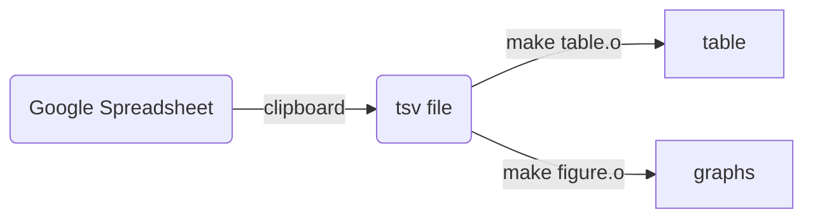

# random-report-template
[README (日本語)](README.ja.md)
repo: https://github.com/rand-tech/random-report-template

- Generates LaTeX tables from tsv
- Generates graphs (.tex) from tsv using gnuplot

## requirements
- LaTeX
- Python
- pandas (python)
- gnuplot

## How to use it
For detailed instructions, see `showcase/report/Final/lazy-LaTeX.pdf` (Japanese).
- `make figure.o`: generates graphs from tsv files
- `make table.o`: generates tables from tsv files



(I use tsv files because tables I copy from Google Spreadsheets will be stored as tsv files.)

## Directory overview
```
❯ tree
.
├── README.md
├── showcase
│   ├── Final
│   └── report
│       ├── Makefile -> ../../skelton-experiment/report/Makefile
│       ├── gnuplot-lua-tikz-common.tex -> ../../skelton-experiment/report/gnuplot-lua-tikz-common.tex
│       ├── gnuplot-lua-tikz.sty -> ../../skelton-experiment/report/gnuplot-lua-tikz.sty
│       ├── info.sty -> ../../skelton-experiment/report/info.sty
│       ├── out
│       │   ├── src
│       │   │   └── data
│       │   └── template.pdf
│       ├── preamble.sty -> ../../skelton-experiment/report/preamble.sty
│       ├── src
│       │   ├── 1mokuteki.tex
│       │   ├── 2genri.tex
│       │   ├── 3houhou.tex
│       │   ├── 4kekka.tex
│       │   ├── 5kousatu.tex
│       │   ├── data
│       │   │   ├── e_showcase.csv
│       │   │   ├── exp_1.gp
│       │   │   ├── latex_e_showcase.csv.tex
│       │   │   ├── make_table.py
│       │   │   └── showcase.tex
│       │   ├── img
│       │   │   └── showcaseimage.png
│       │   └── references.bib
│       └── template.tex
└── skelton-experiment
    ├── Final
    └── report
        ├── Makefile
        ├── gnuplot-lua-tikz-common.tex
        ├── gnuplot-lua-tikz.sty
        ├── info.sty
        ├── out
        │   ├── src
        │   │   └── data
        │   └── template.pdf
        ├── preamble.sty
        ├── src
        │   ├── 1mokuteki.tex
        │   ├── 2genri.tex
        │   ├── 3houhou.tex
        │   ├── 4kekka.tex
        │   ├── 5kousatu.tex
        │   ├── data
        │   │   └── make_table.py
        │   ├── img
        │   └── references.bib
        └── template.tex

```


